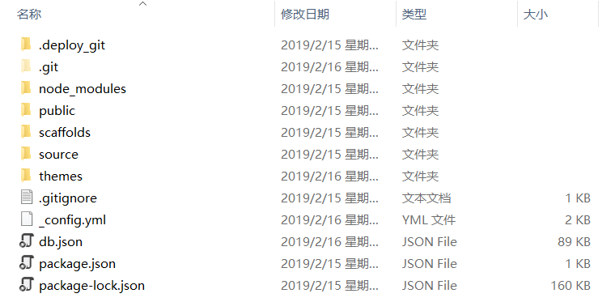
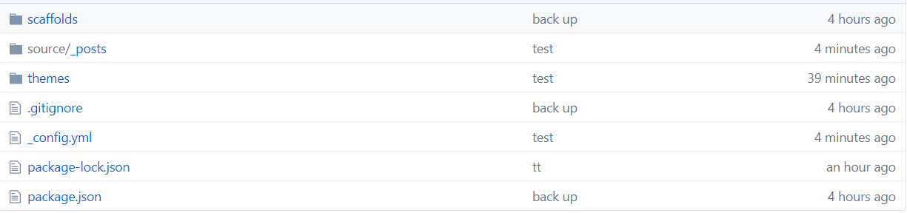

## 新电脑如何编写博客

一、 配置

1. 旧电脑hexo文件夹拷贝到新电脑，建议备份到github，然后新电脑更新即可，如果themes文件夹下存在.git，则删除后更新到github，如果github上themes文件夹还没有正确更新，则需要在themes文件夹下运行如下命令清除缓存再次更新。
```
git rm -r --cached .
```


<center><font size=2>本地文件夹</font></center>


<center><font size=2>github文件夹</font></center>

2. 新电脑需要配置Node.js环境和git环境，安装hexo
```
npm install hexo -g
```

3. 在hexo文件夹下运行
```
npm install
hexo g
hexo d
```

二、编写博客

1. 新建并生成博客，可以用`hexo s`本地查看
```
hexo new post "你好，hexo"
hexo g
hexo d
```

2. 更新hexo文件夹到github
```
git add .
git commit -m "注释"
git push
```